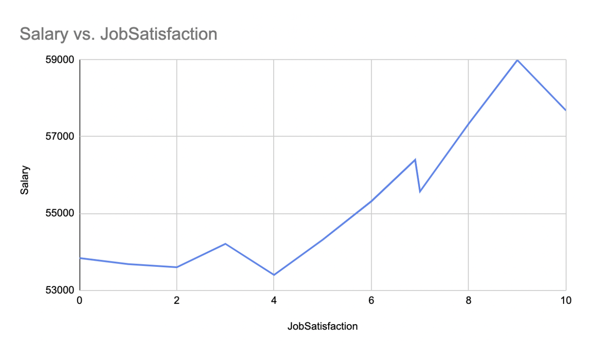

# data_science_blog
stack overflow 2017, Developers survey 2017
# What does the developer's survey think about Job Satisfaction?

### Introduction

I’ll use the StackOverflow developer survey 2017, and we will take a closer look at these questions and the data which contains 64000 reviews from 213 countries, the aim of the survey was to understand the job-related aspect in the software development field.

There are two DataFrame in the dataset, first is schema_df and second is survey_df. The schema_df contains the schema of the question which being asked during the servey process, that has one-to-many answer related to the questions. The survey_df contains the result the feedback for the question.

Step 1:
1. Took over view of the both dataFrame in the notebook.
2. Visulized null value in the notebook to idenfity the columns and there presence in the columns itself.
3. Visulize the correlation with the help of heatmap, to identify relations.

### Is empoyment status has relation to job statisfaction?
Reviewed the JobSatisfaction and EmploymentStatus in the survey_df. That turn out be no missing value in EmploymentStatus, however I found 0.2143 missing values in 
JobSatisfaction column, so filled all the NA value of the JobSatisfaction by filling in the mean of the column, by doing so I got the appropate dataframe to find the relation in between. 

Output
```console
EmploymentStatus

Independent contractor, freelancer, or self-employed    7.202299
Not employed, and not looking for work                  6.957094
I prefer not to say                                     6.957078
Retired                                                 6.957078
Not employed, but looking for work                      6.957078
Employed full-time                                      6.928428
Employed part-time                                      6.879209
Name: JobSatisfaction, dtype: float64
```
**JobSatisfaction and EmploymentStatus**


In the above results, It's clearly idendicate that the Independent contractor, freelancer, or self-employed are statisfied in the group.

### Are you a hobby programmer or/and contributor to open source projects, how it is related to job satisfaction?

It's interesting the have look on the hobbies with the professional outcome as the job satisfaction. I followed below step to find out the outcome.
1. finding out the null values in the ProgramHobby and JobSatisfaction.
2. Found that there were no entries where missing.
3. Group by based on the hobby and their satisfaction ratiing. 
4. Once everything, got the result of the analysis. 

Output
```console
ProgramHobby

Yes, both                                    7.108041
Yes, I contribute to open source projects    7.041535
Yes, I program as a hobby                    6.913072
No                                           6.833825
```
** hobby programmer, contributor and EmploymentStatus**


Result shown that the most of the satisfied people have hooby as programming or they contribute to the open source project.


### Does Salary gives you job satisfaction?
It's always seems like the salary give satisfaction, let's find with the given dataset, alot of salary information as missing, there could be a answer to fill the dataset with the mean of the value however i think, it's not good idea to fill the mojor chunk with the help of the given sample value, in the other hand, i could be possible but may lead to different conclusions.

1. Checked for the missing values.
2. Major chunk is missing, decide to drop missing values.
3. Plot the relationship between JobSatisfaction and Salary

```console
JobSatisfaction

0.0     47111.799610
1.0     48100.740801
2.0     48289.403289
3.0     49952.709955
4.0     47201.877289
5.0     49478.845404
6.0     53221.769136
7.0     54093.964298
8.0     59485.961163
9.0     64089.922631
10.0    61440.444486
```
** hobby programmer, contributor and EmploymentStatus**


There are avidence that salary gives motivation towards job satisfaction, both are proportional to each other.
